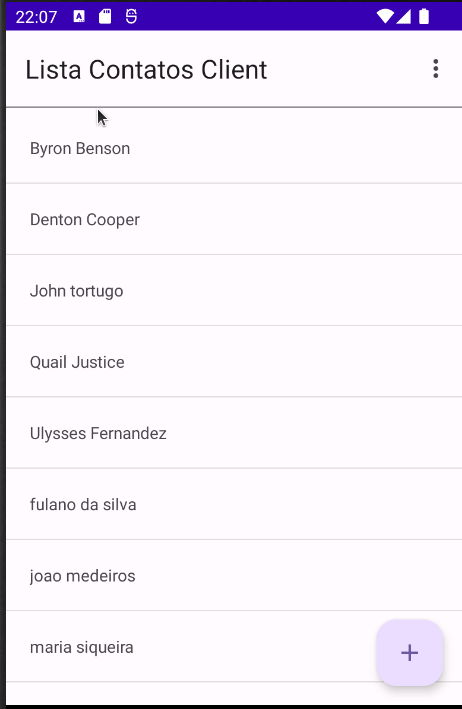
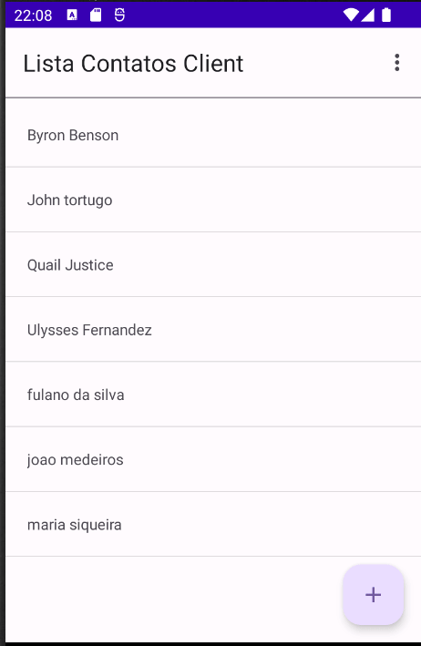
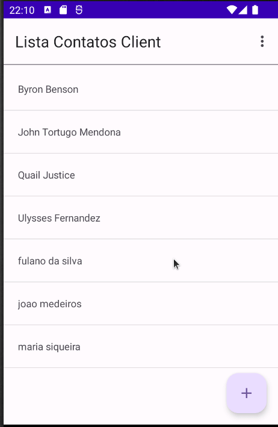
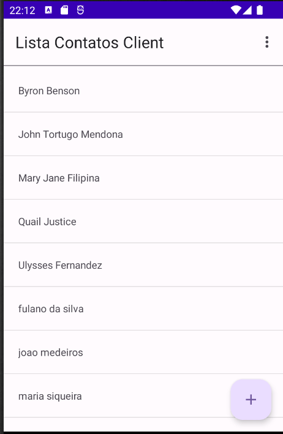
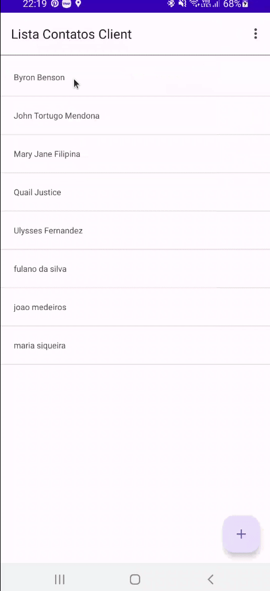

# Atividade 03 - Lista Contatos Client

Consulte o enunciado (PDF) no Moodle para conhecer as especificações da atividade.

A seguir estão listados os GIFs mencionados no enunciado da atividade.03

## Remoção (GIF-2)

## Atualização (GIF-3)

## Validação (GIF-4)

## Ocultamento de campos nulos (GIF-5)

## Intents (GIF-6)

